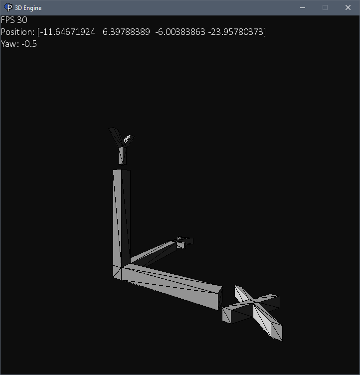

Create and simulate objects in 3D space.

Run `python main.py` to run the program with `axis.obj`:

Move with WASD, Space, Shift, and Mouse to turn. Press Enter to toggle mouse free mode -> turn with arrow keys instead.
